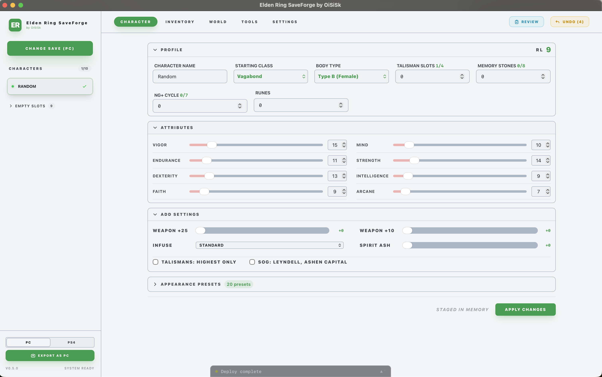
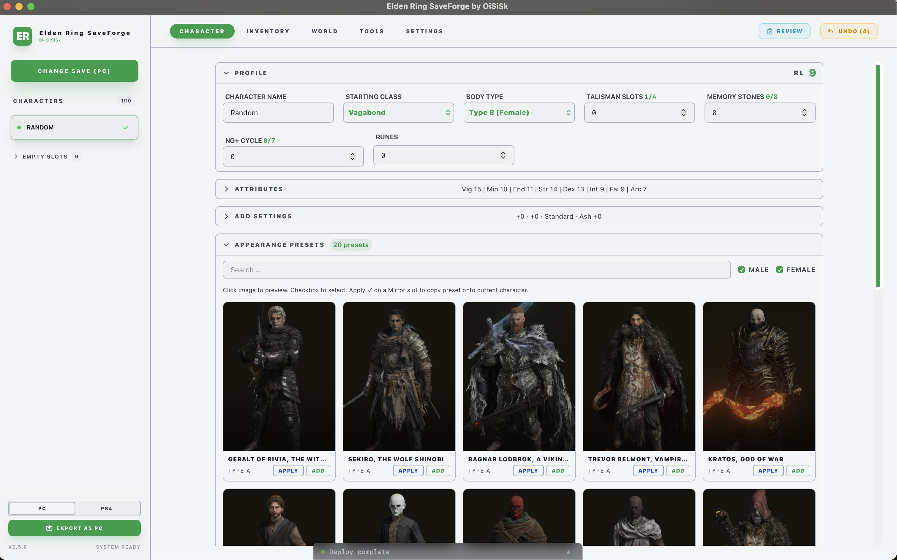
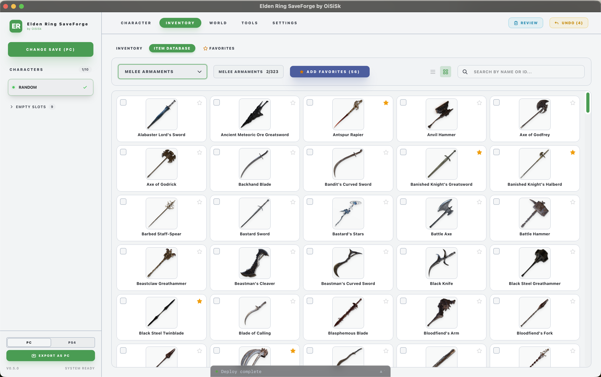
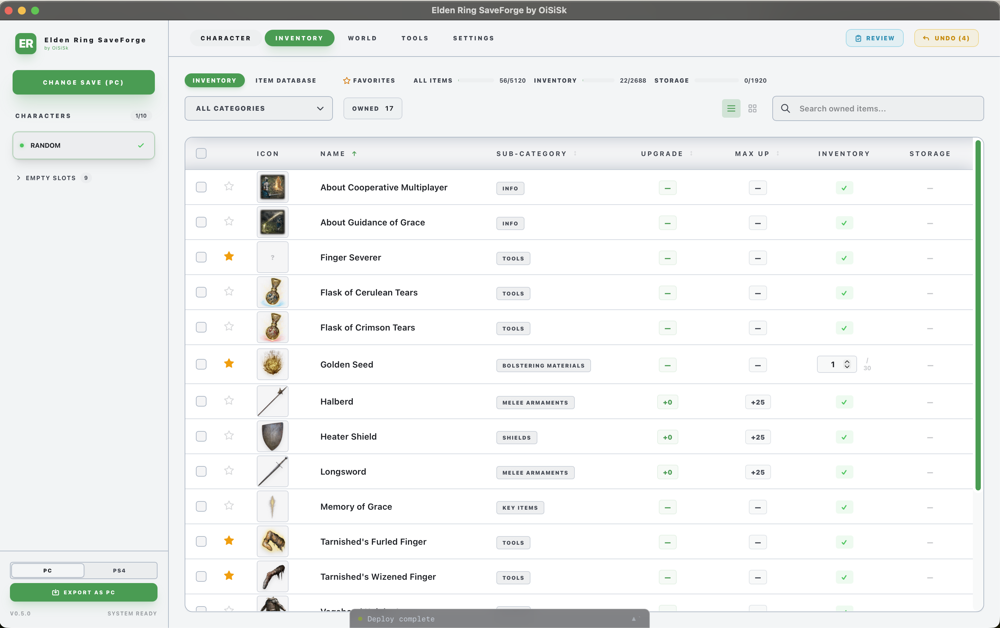
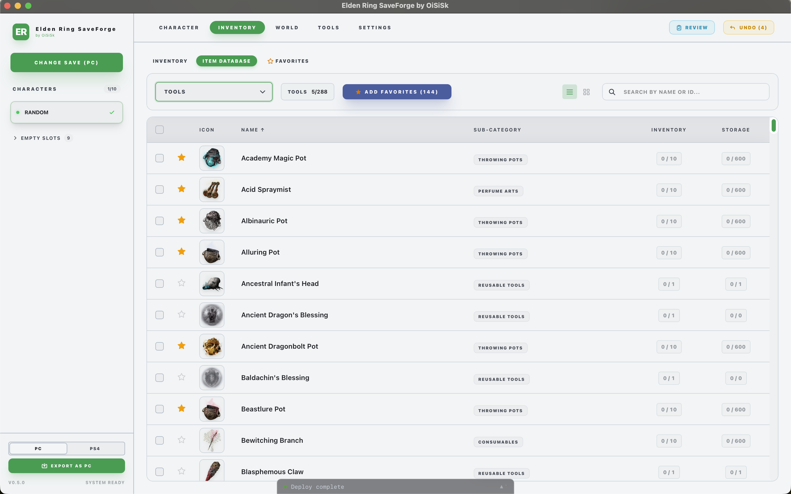
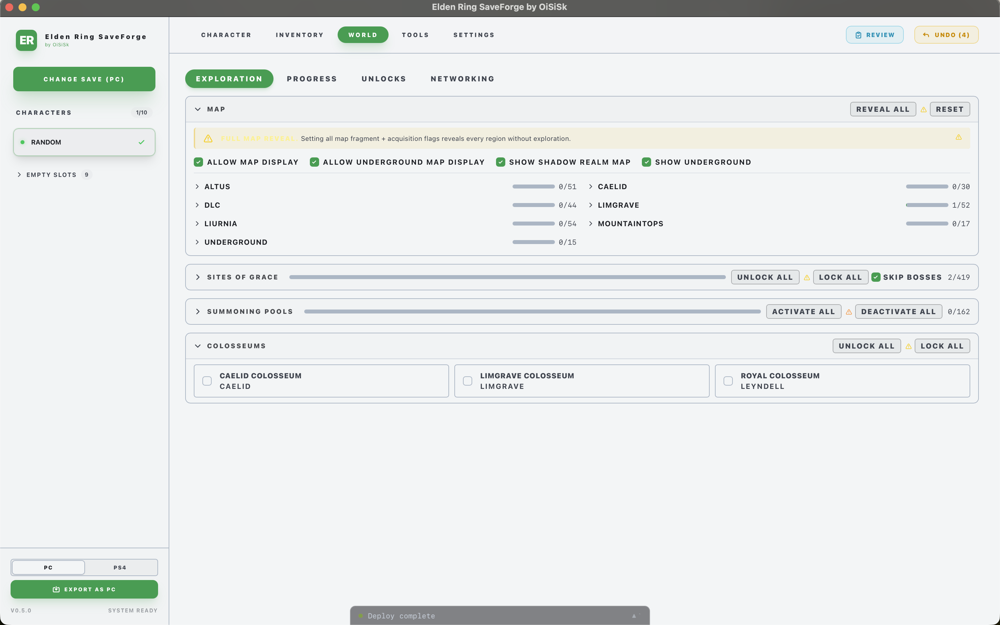
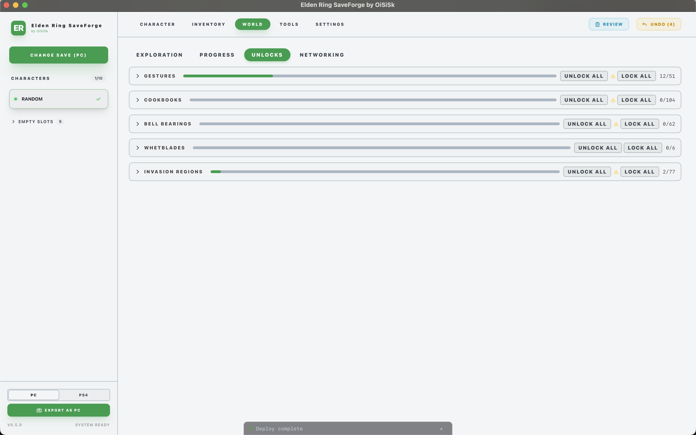
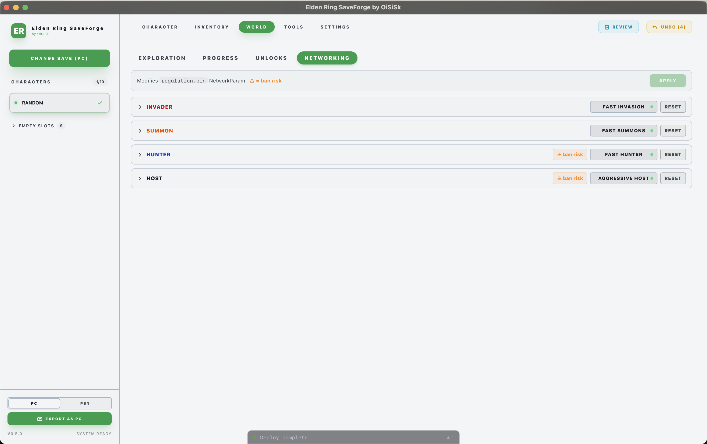
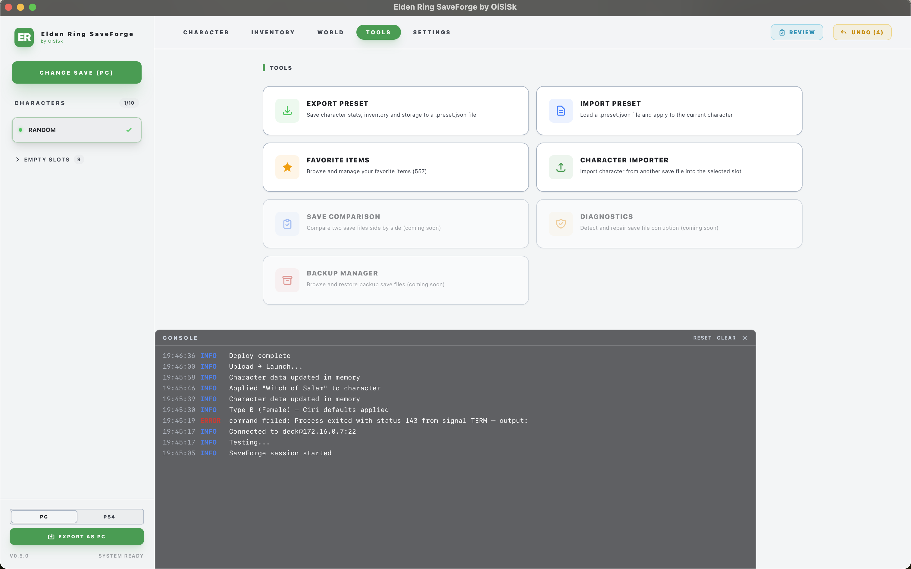
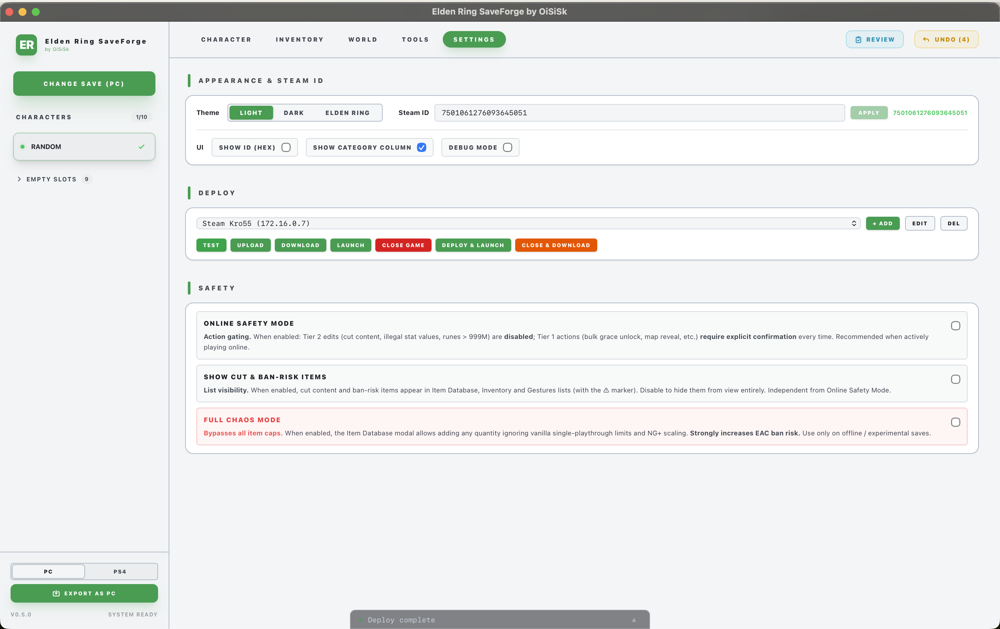

# ER Save Editor

> **WARNING: This software is in early development and is NOT stable. It can corrupt your save files beyond recovery. Do NOT use it on your main account or primary save files. Always work on copies. You have been warned.**

Desktop application for editing Elden Ring save files (`.sl2` / `memory.dat`). Built with [Wails v2](https://wails.io/) (Go backend + React/TypeScript frontend).

## Screenshots

<p align="center">
  <a href="docs/screenshots/2.png"></a>
  <a href="docs/screenshots/1.png"></a>
</p>
<p align="center">
  <a href="docs/screenshots/5.png"></a>
  <a href="docs/screenshots/3.png"></a>
</p>
<p align="center">
  <a href="docs/screenshots/4.png"></a>
  <a href="docs/screenshots/6.png"></a>
</p>
<p align="center">
  <a href="docs/screenshots/7.png"></a>
  <a href="docs/screenshots/8.png"></a>
</p>
<p align="center">
  <a href="docs/screenshots/9.png"></a>
  <a href="docs/screenshots/10.png"></a>
</p>

## Features

**Save file support**
- PC (Steam `.sl2`) and PS4 (`memory.dat`) — read, edit, write
- Two-way platform conversion: PS4 ↔ PC
- AES-128-CBC encryption/decryption for PC saves
- Automatic backup before every write

**Character**
- Stats: level, all 8 attributes, runes, NG+ cycle
- Class, body type, talisman slots, memory stones
- Scadutree Blessing & Shadow Realm Blessing (Shadow of the Erdtree)
- Quick-add shortcuts: max weapon upgrades, infuse type, spirit ash, talisman unlock
- 20+ appearance presets with preview images — apply directly or push to in-game Mirror Favorites
- Export / import character presets as `.json` (stats + inventory + appearance)

**Inventory & Item Database**
- Full inventory and storage box: add, remove, set quantities
- 2300+ items with icons — weapons, armor, talismans, spells, tools, key items and more
- Grid and list views; search by name or ID; favorites system
- Per-item vanilla quantity caps with NG+ scaling awareness

**World**
- Map reveal: per-region fog-of-war + Map Fragment flags + DLC cover layer
- Sites of Grace: unlock / lock individually or all at once
- Summoning Pools: activate / deactivate
- Colosseums: unlock / lock
- Gestures, Cookbooks, Bell Bearings, Whetblades, Invasion Regions

**PvP / Networking** *(PC saves only — see Known Issues)*
- NetworkParam tuning: invader, summon, hunter and host presets
- Ban-risk labels on dangerous operations; Online Safety Mode to gate high-risk actions

**Tooling**
- Steam Deck deploy: upload, download, launch and close game over SSH in one click
- Character Importer: copy a character from another save file
- In-app console log for all operations

## Supported Platforms

| Save Format | File | Encryption | Status |
|---|---|---|---|
| PC (Steam) | `ER0000.sl2` | AES-128-CBC | Supported |
| PS4 | `memory.dat` | None | Supported (priority) |

## Building

Requirements: Go 1.23+, Node.js 20+, [Wails CLI v2](https://wails.io/docs/gettingstarted/installation)

```bash
# Install dependencies
make deps

# Build for current platform
make build

# Run in development mode (requires GUI)
make dev

# Run tests
make test
```

## Development

```
.
├── backend/
│   ├── core/        # Save file I/O: reader, writer, crypto, structures
│   ├── db/          # Game database: items, graces, event flags
│   └── vm/          # ViewModel: maps binary data to UI-friendly structs
├── frontend/src/    # React + TypeScript + Tailwind CSS
├── tests/           # Round-trip and unit tests
└── Makefile
```

## Documentation

- [SL2 Binary Format Specification](docs/sl2-binary-format-spec.md) — full technical spec of the `.sl2` save file format (offsets, structures, crypto, checksums)
- [Roadmap](docs/ROADMAP.md) — planned features and progress
- [Changelog](docs/CHANGELOG.md) — release history

## Known Issues

**Networking tab crashes PS4 saves.**
Editing or resetting NetworkParam on a PS4 save (`memory.dat`) causes the game to crash on load.
Root cause: the Go ZSTD encoder produces a different frame format than FromSoftware's encoder
(different window size and frame header flags); PS4 rejects the recompressed `regulation.bin`.
**Workaround:** do not use the Networking tab when a PS4 save is loaded. PC saves are not affected.
Fix in progress.

## License

This project is not affiliated with FromSoftware or Bandai Namco.
